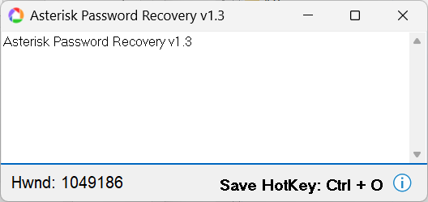

# Asterisk Password Recovery

A tiny Windows utility (Delphi/VCL) that recovers passwords hidden behind asterisks (`****`) in password-masked text fields, by hovering the mouse over the field.

## Why

Password managers, old installers, FTP/email clients, router config pages, and countless legacy Windows apps store a saved password behind a masked `****` field with no "show password" option. If you've forgotten the actual password but the app still has it saved, this tool reveals it — without touching any files, config, or memory belonging to other processes beyond reading the visible text of the control itself.

## How it works

On a timer tick, the app:
1. Reads the current mouse cursor position.
2. Finds the window/control handle (`HWND`) under the cursor.
3. Temporarily clears the control's password-mask character (`EM_SETPASSWORDCHAR`).
4. Reads the control's text (`WM_GETTEXT`) and displays it in the app window.

This relies on a long-documented behavior of the Windows Edit control and works only on standard Win32 masked edit fields that are visible on your own screen, in your own logged-in session.

## Usage

1. Run `AsteriskPasswordRecovery.exe`.
2. Hover your mouse over the masked password field you want to reveal.
3. The plaintext value appears in the app window, along with the target window's handle (`Hwnd`).
4. Press **Ctrl+O** (or click the hotkey label) to save the captured result to a text file.

## Building from source

Written in Object Pascal (Delphi). Open `AsteriskPasswordRecovery.dpr` in Delphi/RAD Studio (or a compatible VCL-based IDE) and compile.

## Limitations

- Works only on standard Win32 Edit-derived masked controls (`EDIT` class). It does not work on custom-drawn password fields, browser-based password fields, or fields in apps that store the password only as a hash/never place plaintext in the control.
- Requires running with sufficient privileges to interact with the target window (e.g., you generally can't read a field in a window running elevated/as admin from a non-elevated instance).

## ⚠️ Responsible use

This tool is intended for recovering **your own** forgotten passwords from **your own** applications. The technique it demonstrates works on any visible masked field on the machine it runs on, regardless of who owns the field — so:

- Do not use it to access accounts, data, or systems you are not authorized to access.
- Do not install or run it on systems you don't own or don't have explicit permission to test.
- You are responsible for complying with applicable laws and the terms of service of any software you use it with.

The author provides this software for legitimate personal password-recovery and educational purposes only, and accepts no liability for misuse.

## License

MIT — see [LICENSE](LICENSE).
